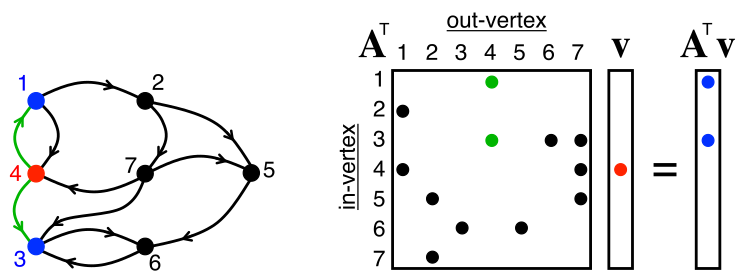
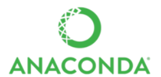
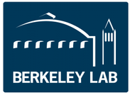
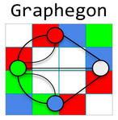
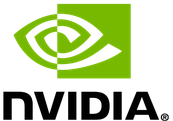
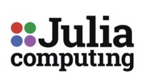

# The GraphBLAS

The GraphBLAS Forum is an open effort to define standard building
blocks for graph algorithms in the language of linear algebra.

We believe that the state of the art in constructing a large
collection of graph algorithms in terms of linear algebraic operations
is mature enough to support the emergence of a standard set of
primitive building blocks.  We believe that it is critical to move
quickly and define such a standard, thereby freeing up researchers to
innovate and diversify at the level of higher level algorithms and
graph analytics applications.  This effort was inspired by the Basic
Linear Algebra Subprograms (BLAS) of dense Linear Algebra, and hence
our working name for this standard is “the GraphBLAS”.

A key insight behind this work is that when a graph is represented by
a sparse incidence or adjacency matrix, sparse matrix-vector
multiplication is a step of breadth first search.  By generalizing the
pair of scalar operations involved in the linear algebra computations
to define a semiring, we can extend the range of these primitives to
support a wide range of parallel graph algorithms.

# More information

[The GraphBLAS Wikipedia Page](https://en.wikipedia.org/wiki/GraphBLAS)

The C reference implementation is
[SuiteSparse:GraphBLAS](http://faculty.cse.tamu.edu/davis/suitesparse.html).

Our 2013 manifesto for this project can be found
[here](http://www.netlib.org/utk/people/JackDongarra/PAPERS/GraphPrimitives-HPEC.pdf).

The mathematical definition of the GraphBLAS can be found
[here](http://www.mit.edu/~kepner/GraphBLAS/GraphBLAS-Math-release.pdf).

Background information about graphs in the language of linear algebra
can be found in the book: [Graph Algorithms in the Language of Linear
Algebra](http://bookstore.siam.org/se22/), edited by J. Kepner and
J. Gilbert, SIAM, 2011.

[The Mathematics of Big
Data](https://mitpress.mit.edu/books/mathematics-big-data) by
J. Kepner and H. Jananthan is the first book to present the common
mathematical foundations of big
data analysis across a range of applications and technologies.

A straw man proposal for the GraphBLAS can be found
[here](http://gauss.cs.ucsb.edu/~aydin/combblas-r2.pdf)

Gabor Szarnyas maintains a list of [GraphBLAS
pointers](https://github.com/szarnyasg/graphblas-pointers) with lots
of tutorial material.

# Application Program Interface (API)

Version 1.0 (provisional) of the C language API is released on May
29, 2017 at the GABB workshop
[here](http://graphanalysis.org/workshop2017.html).

Version 1.1.0 (provisional) is released on November 14, 2017.

Version 1.2.0 (final) is released on May 18, 2018. It can be
downloaded from
[here](http://people.eecs.berkeley.edu/~aydin/GraphBLAS_API_C_v12.pdf). This
is only available for archival purposes, you should use the latest
version 1.3.0 below.

Version 1.3.0 (final) is released on September 25, 2019. It can be
downloaded from
[here](http://people.eecs.berkeley.edu/~aydin/GraphBLAS_API_C_v13.pdf).

# Projects developing implementations of the GraphBLAS

* [SuiteSparse Graph BLAS (Texas A&M)](http://faculty.cse.tamu.edu/davis/suitesparse.html)

* [IBM GraphBLAS](https://github.com/IBM/ibmgraphblas)

* [GraphBLAS Template Library (SEI/Indiana)](https://github.com/cmu-sei/gbtl)

* [GraphBLAST (UC Davis and LBNL)](https://github.com/gunrock/graphblast)

* [MPI/C++ Combinatorial BLAS (CombBLAS)](https://github.com/PASSIONLab/CombBLAS)

* [Java Graphulo](http://graphulo.mit.edu)

* [Matlab/Octave D4M](http://d4m.mit.edu)

* [GraphPad (Intel)](https://github.com/narayanan2004/GraphMat/tree/distributed_primitives_integration)

# Programming Language Interfaces to The GraphBLAS API

* [MATLAB (comes with SuiteSparse)](http://faculty.cse.tamu.edu/davis/suitesparse.html)

* [pygraphblas Python library](https://github.com/michelp/pygraphblas)

* [grblas Python library](https://github.com/metagraph-dev/grblas)

* [pggraphblas Postgres extension](https://github.com/michelp/pggraphblas)

* [Julia library](https://github.com/JuliaSparse/SuiteSparseGraphBLAS.jl)

# Graph analysis systems that integrate GraphBLAS

* [RedisGraph: A Graph Database Module for
  Redis](https://redislabs.com/redis-enterprise/redis-modules/redis-enterprise-modules/redisgraph/)

# Workshops and conferences featuring the GraphBLAS (reverse chronological)

* [SIAM CSE'21 GraphBLAS Minisymposium Session 1](https://meetings.siam.org/sess/dsp_programsess.cfm?SESSIONCODE=70090)

* [SIAM CSE'21 GraphBLAS Minisymposium Session 2](https://meetings.siam.org/sess/dsp_programsess.cfm?SESSIONCODE=70091)

* [SIAM CSE'21 GraphBLAS Tutorial Session 1](https://meetings.siam.org/sess/dsp_programsess.cfm?SESSIONCODE=69893)

* [SIAM CSE'21 GraphBLAS Tutorial Session 2](https://meetings.siam.org/sess/dsp_programsess.cfm?SESSIONCODE=70367)

* [Graphs, Architectures, Programming, and Learning (GrAPL) @IPDPS](http://hpc.pnl.gov/grapl/)

* [High Performance Extreme Computing (HPEC)](http://www.ieee-hpec.org/)

* [GraphChallenge.org](http://GraphChallenge.org/)

* [HPEC 2020](http://www.ieee-hpec.org/2020/)

* [HPEC 2019](http://www.ieee-hpec.org/2019/)

* [HPEC 2018](http://www.ieee-hpec.org/2018/)

* [GABB 2018 @IPDPS](http://graphanalysis.org/workshop2018.html)

* [HPEC 2017](http://www.ieee-hpec.org/2017/)

* [GABB 2017 @IPDPS](http://graphanalysis.org/workshop2017.html)

* [HPEC 2016](http://www.ieee-hpec.org/2016/)

* [GABB 2016 @IPDPS](http://graphanalysis.org/workshop2016.html)

* [HPEC 2015](http://www.ieee-hpec.org/2015/)

* [GABB 2015 @IPDPS](http://graphanalysis.org/workshop2015.html)

* [HPEC 2014](http://www.ieee-hpec.org/2014/copy/agendatext.html)

* [GABB 2014 @IPDPS](http://graphanalysis.org/workshop2015.html)

* [HPEC 2013](http://ieee-hpec.org/2013/agenda.htm)

# Videos and other interesting discussions on GraphBLAS

* [Graph Analytics, by Tim Mattson and Henry Gabb, Intel](https://techdecoded.intel.io/big-picture/graph-analytics-a-foundational-building-block-for-the-data-analytics-world/#gs.x2ak71)

* [Short video description of GraphBLAS](https://youtu.be/wqjRzC2fPUo)

* [HPEC'20 presentation on GraphBLAS in Python and MATLAB](https://youtu.be/YuqoTxWnO8Y)

* [Presentation at UT Austin](https://www.oden.utexas.edu/about/events/1520)

* [A good discussion thread on dropping explicit zeros (fall
  2019)](https://github.com/GraphBLAS/LAGraph/issues/28#issuecomment-542952115)

# GraphBLAS mailing list

If you wish to join our effort (or just watch it), please send an
email message to our [mailing list coordinator](mailto:abuluc@lbl.gov).

# Steering Committee (alphabetical)

* [David Bader (NJIT)](https://davidbader.net/)

* [Aydin Buluc (Berkeley Lab)](https://people.eecs.berkeley.edu/~aydin/)

* [John Gilbert (UC Santa Barbara)](http://www.cs.ucsb.edu/~gilbert/)

* [Jeremy Kepner (MIT Lincoln Laboratory Supercomputing Center)](http://www.mit.edu/~kepner/)

* [Tim Mattson (Intel)](http://timmattson.com/work/)

* [Henning Meyerhenke (KIT)](https://www.informatik.hu-berlin.de/de/forschung/gebiete/macsy/Team/meyerhenke)

# The GraphBLAS is supported by the following organizations

<table>
    <tr>
    <td></td>
    <td></td>
    <td></td>
    <td></td>
    <td></td>
    <td></td>
    </tr>
    <tr>
    <td></td>
    <td></td>
    <td></td>
    <td></td>
    <td></td>
    <td></td>
    </tr>
    <tr>
    <td></td>
    <td></td>
    <td></td>
    <td></td>
    <td></td>
    <td></td>
    </tr>
    <tr>
    <td></td>
    <td></td>
    <td></td>
    <td></td>
    </tr>
</table>

## Code of Conduct

Everyone interacting in the GraphBLAS project's codebases, issue
trackers, chat rooms, online events, and mailing lists is expected to
follow the [Contributor Covenant Code of Conduct](code_of_conduct.md).

### The GraphBLAS logo is licensed under [CC BY 4.0](https://creativecommons.org/licenses/by/4.0/) (designer: Jakab Rokob)

